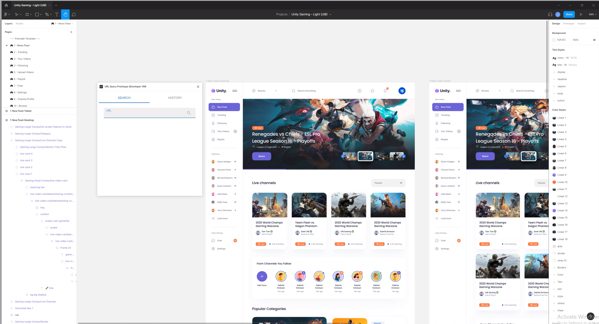
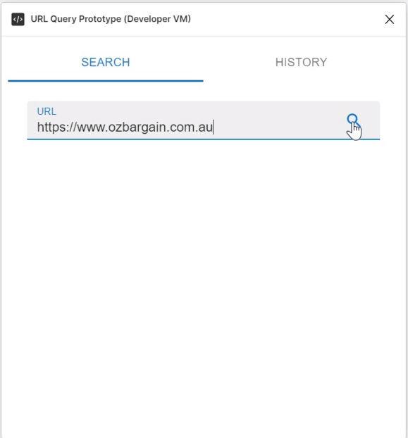
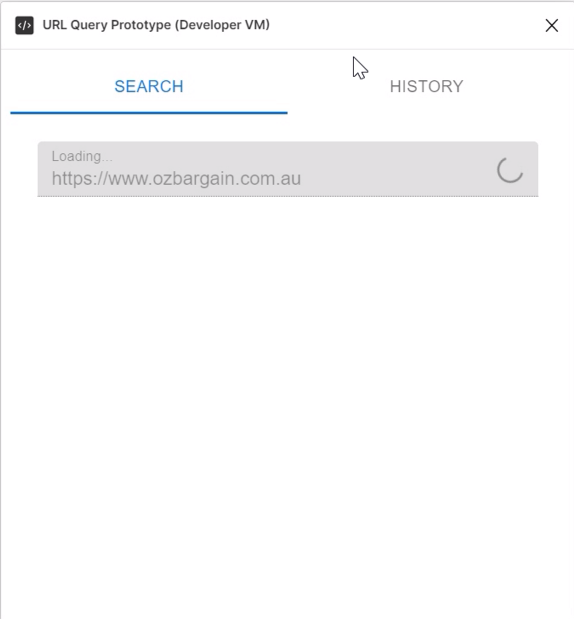
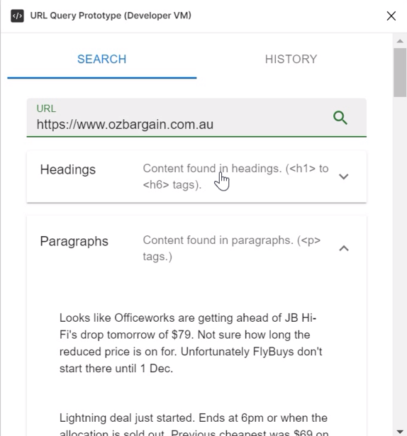
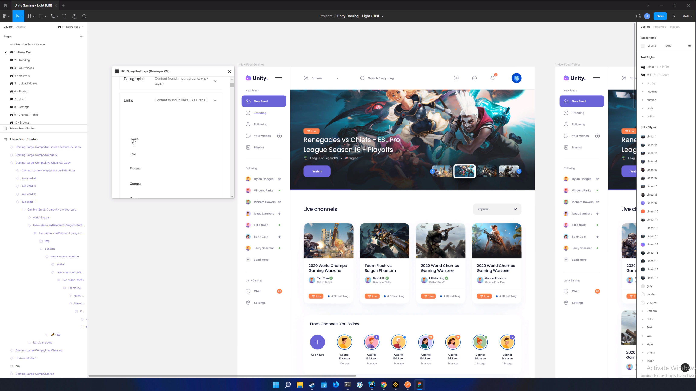
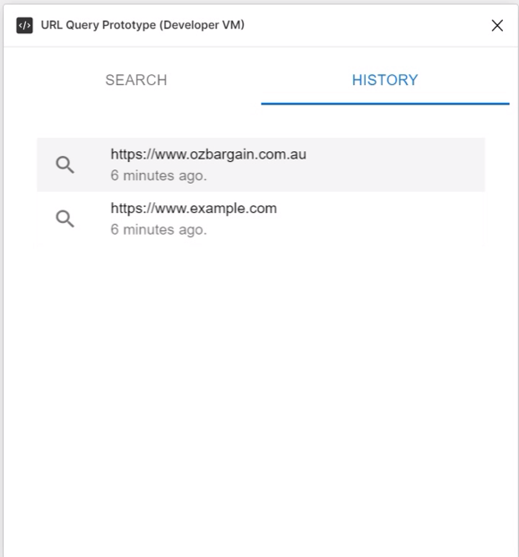

# Figma Content Requester

## Overview

Figma Content Requester is a figma plugin written in ReactJS. This plugin allows designers to enter a website URL,
which will then retrieve and categorize general content from the website, allowing them to swap content by selecting 
a content element from the design, such as a heading or piece of text, and then selecting one of the returned 
content entries from the website. The content will then be replaced with the selected content entries.

    

### Step 1 - Enter URL

### Step 2 - Search

### Step 3 - Review Available Content

### Step 4 - Select Content to replace

### Step 5 - Replace Content

### History

Additionally, users will be provided with a history of recent search URLs, which are clickable to search content for 
that website again.

[comment]: <> (This template contains the react example as shown on [Figma Docs]&#40;https://www.figma.com/plugin-docs/intro/&#41;, with some structural changes and extra tooling.)

## Quickstart
* Run `yarn` to install dependencies.
* Run `yarn build:watch` to start webpack in watch mode.
* Open `Figma` -> `Plugins` -> `Development` -> `New Plugin...` and choose `manifest.json` file from this repo.

## Toolings
This repo is using:
* React + Webpack
* TypeScript
* Prettier precommit hook
